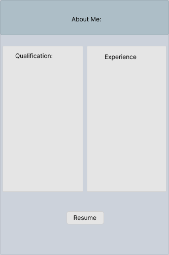

# Portfolio
It's a little about me that includes my experience, qualification and projects that I worked on while pursuing the course from Per Scholas.

## Wireframe of the Project:

## Built with 

## Author and contact:
B_Nagarkoti 
indu.ghugtyal@gmail.com

## Acknowledgment
### My Instructors: Abraham E. Tavarez, Colton Wright, Laura Minaya

https://react.dev/learn/thinking-in-react
https://newsapi.org/
https://www.w3schools.com/howto/howto_css_blurred_background.asp
